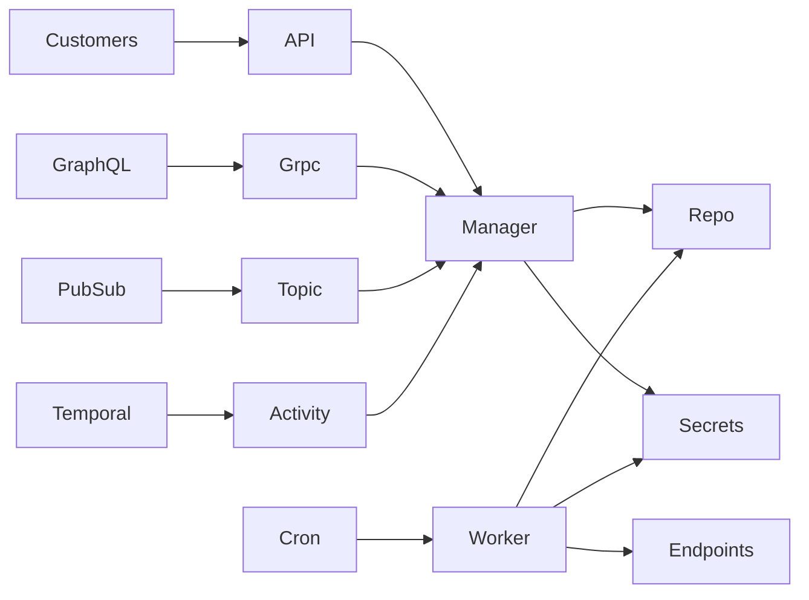
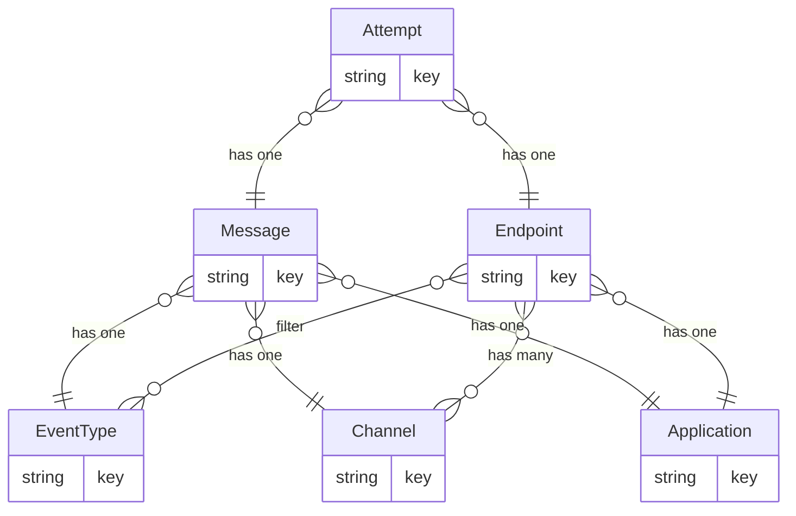

# Web-of-Hooks
# Project Structure
- `.vscode` VSCode configs
- `cmd` CLI Commands
  - `call`  Call Webhooks Grpc
  - `serve` Run Webhooks Manager
  - `worker` Run Webhooks Worker
- `demo` Examples
  - `grpc` Create Messages from gRPC
  - `pubsub` Create Messages from PubSub
  - `temporal` Create Messages from Temporal
- `internal` Implementation
  - `domain` Domain Logic
    - `manager` Service to Manage Data
    - `worker` Service to Send WebHook Messages
  - `provide` Provider Implementations
    - `repo` Postgres Access
      - `migrations` Database DDL
      - `queries` Database DQL/DML
    - `secrets` Vault Access 
- `package` Generic Code
  - `actor` Lifecycle Manager
    - `cron` Base Cron Adapter
    - `net` Network Modules
      - `grpc` Grpc Actors
        - `server` Grpc Adapter
        - `client` Grpc Provider
      - `http` Http Actors
        - `server` Http Adapter
        - `client` Http Provider
  - `app` Application Utilities
    - `cfg` Configuration Utilities
    - `cmd` Command Line Utilities
    - `flag` Flag Utilities
  - `util` Generic Utilities
- `webhooks` Application Adapters
  - `cron` Cron for Workers
  - `grpc` Internal API
    - `v1` Grpc Definition
  - `html` Browser API
    - `components` Reusable Atomic Components
      - `atom` Simple Composable Components
      - `molecule` Encapsulation of Components
    - `layouts` Reusable Aggregate Dispositions
    - `pages` Pages to Render
    - `scripts` Reusable JavaScript
    - `styles` Style Definitions
    - `utils` Utility Methods
  - `http` External API
    - `v1` OAPI Definition
  - `pub` Publisher
    - `v1` Produced Message Definition
  - `subs` Subscriber
    - `v1` Consumed Message Definition 

# High Level Architecture

# Entity-Relation Diagram

# Make
- `make` alias for `make down db gen`
- `make up` alias for `docker-compose up -d`
- `make down` alias for `docker-compose down`
- `make wait CONTAINER=...` waits for container to be healthy 
- `make gen` alias for `make gen/grpc gen/api gen/db`
  - `make gen/grpc` Generates gRPC structurs
  - `make gen/api` Generates HTTP structures
  - `make gen/db` Generates SQL structures
- `make db` alias for `make db/up db/push`
  - `make db/up` starts db and waits for it to be healthy
  - `make db/push` runs db migrations

# Compose
- Postgres
- Vault

# Develop

- Clone: `git clone https://github.com/andrestielau/web-of-hooks`
- Enter: `cd web-of-hooks`
- Bootstrap: `make` (yes, just `make`)
- Run: `go run . serve`
- Test `https://port3000.[your-name].anchorlabs.dev/health`

# Tasks:
- Adapters
  - [ ] Http
  - [ ] Grpc
  - [ ] Subs
  - [ ] Work
- Services
  - [ ] Manager
  - [ ] Worker
- Providers
  - [ ] Repo
  - [ ] Secrets
  
# Goals 
- [ ] onboard tenants (create applications) (grpc + db)
- [ ] register event-types (CRUD event-types) (grpc + db)
- [ ] manage configs (edit application + CRUD endpoint) (http/grpc + db)
- [ ] register messages (create message) (grpc/http/pubsub/temporal + db)
- [ ] worker calls (dequeue + submit)
# Bonus
- [ ] Integrate grpc with GraphQL (grpc + graphql)
- [ ] Integrate with existing workflows (temporal)
- [ ] Integrate with existing API (http)
# Cherry on Top
- [ ] Integrate with Backoffice Dashboard
- [ ] Integrate with Client Dashboard
  
# Other Ideas
- Reusable Secrets
- Publish Errors and/or Successes
- OTEL Metrics